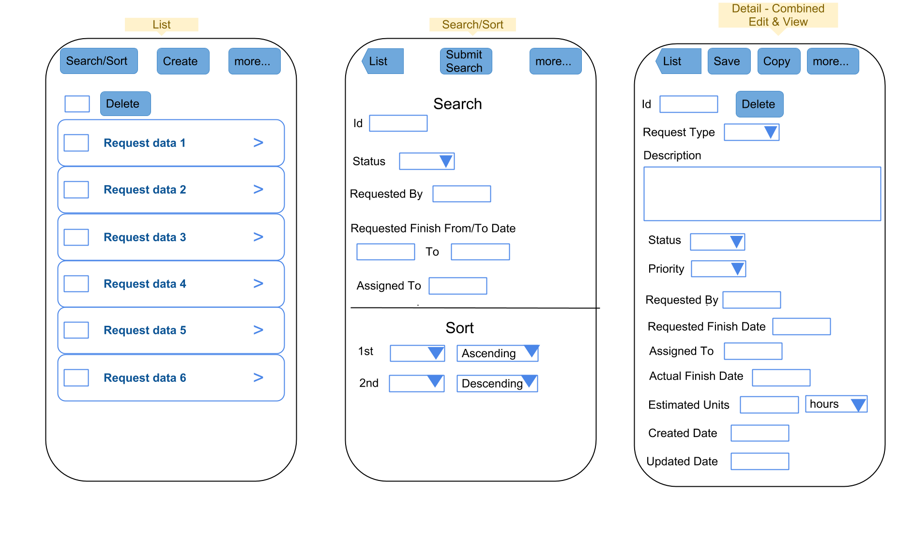
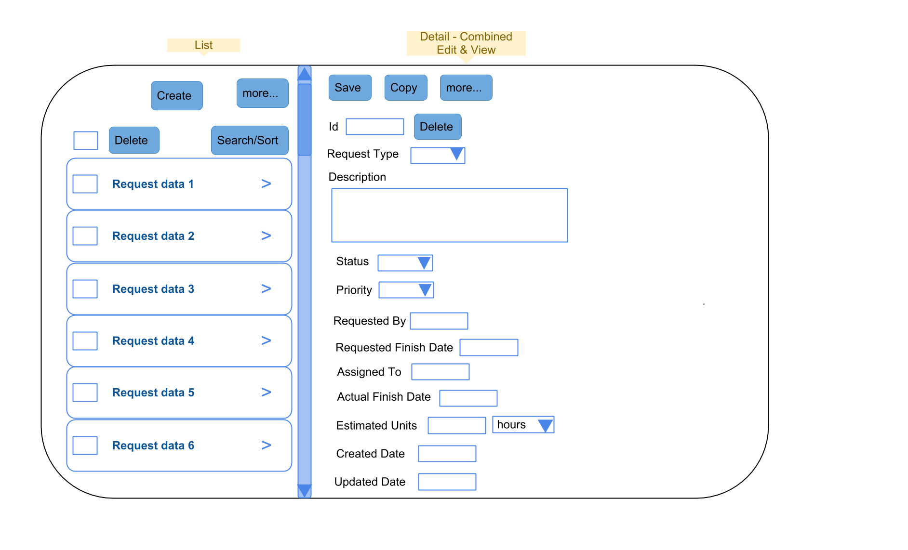

# dApp Example: Request App
Shows a simple App of 3 views for work orders requests using the dApp Framework

## Install
1. Clone the repository using `git clone --recursive https://github.com/csantanapr/dapp-examples.git`
2. Run `build.sh`, which will create an web optimized build in `dist/www`.
3. Run `cordova.sh` builds a Native App using your web code using [Apache Cordova/PhoneGap](http://cordova.io)

## App Requirements
The client provided wireframes and some documentation for the desire functionality of the App.

- Requirement documentation: [docs/ReferenceImplementationRequirementsandDocumentation.pdf](docs/ReferenceImplementationRequirementsandDocumentation.pdf "ReferenceImplementationRequirementsandDocumentation").
- Request Phone Wireframes
    - 
- Request Tablet and Desktop Wireframes
    - 

### Dual License
The dapp-request Application is licensed under the [same
terms](https://github.com/dojo/dojo/blob/master/LICENSE) as the Dojo
Toolkit.

* [BSD](https://github.com/dojo/dojo/blob/master/LICENSE#L13)
* [AFLv2.1](https://github.com/dojo/dojo/blob/master/LICENSE#L43)
